# Dane Bez Twarzy

Projekt hackathonowy stworzony podczas HackNation (06.12.2025-07.12.2025), mający na celu automatyczną anonimizację danych osobowych (PII) w dokumentach tekstowych w języku polskim oraz generację danych syntetycznych z zachowaniem poprawnej morfologii.

---

## 📚 Dokumentacja projektu

- **[Product Requirements Document (PRD)](README.PRD.md)** – Szczegółowy opis problemu, proponowanego rozwiązania, wymaganych klas anonimizacji oraz kryteriów oceny projektu.

- **[Minimum Viable Product (MVP)](README.MVP.md)** – Analiza MVP, zakres funkcjonalności, kryteria sukcesu oraz sugerowany stack technologiczny.

---

## 🔧 Instalacja i konfiguracja

### Część 1: Moduł anonimizacji

> **Uwaga:** Instrukcja instalacji i konfiguracji modułu anonimizacji będzie uzupełniona przez członka zespołu odpowiedzialnego za tę część projektu.

---

### Część 2: Moduł syntezy danych (`synthesize`)

Moduł `synthesize` odpowiada za generację danych syntetycznych do zanonimizowanych tekstów. Zastępuje tokeny `[name]`, `[city]`, `[pesel]`, etc. na realistyczne polskie dane z zachowaniem poprawnej morfologii.

#### Wymagania wstępne

- **Python 3.12+**
- **uv** (Python package manager) - [instrukcja instalacji](https://github.com/astral-sh/uv)
- **Ollama** (dla lokalnych modeli LLM) - [instrukcja instalacji](https://ollama.ai)

#### Instalacja

1. Przejdź do katalogu modułu (z głównego katalogu projektu):
```bash
cd synthesize
```

2. Utwórz środowisko wirtualne i zainstaluj zależności:
```bash
uv venv
source .venv/bin/activate  # Linux/Mac
# lub
.venv\Scripts\activate  # Windows

uv pip install -e .
```

3. Pobierz model Ollama (dla trybu lokalnego):
```bash
ollama pull PRIHLOP/PLLuM:latest
# lub alternatywnie:
ollama pull gpt-oss:latest
ollama pull gemma3:12b
```

#### Konfiguracja zmiennych środowiskowych

**Domyślne zachowanie:** Moduł działa w trybie lokalnym z Ollama, **bez konieczności konfiguracji zmiennych środowiskowych**. 

Zmienne środowiskowe są potrzebne **tylko** jeśli chcesz używać modelu online (PLLuM API). W takim przypadku:

1. Skopiuj plik przykładowy:
```bash
# Z katalogu synthesize/
cp env.example .env
```

2. Edytuj `.env` i ustaw:
```bash
PLLUM_API_KEY=your_api_key_here
USE_ONLINE=true  # Opcjonalnie, aby domyślnie używać trybu online
```

**Domyślny rezultat (bez konfiguracji):**
- Tryb: **lokalny (Ollama)**
- Model: `ollama/PRIHLOP/PLLuM:latest`
- Wszystkie funkcje działają bez dodatkowej konfiguracji

#### Konfiguracja pliku config.yaml

Moduł używa pliku `config.yaml` do konfiguracji. Domyślne ustawienia:

- **Model LLM:** `ollama/PRIHLOP/PLLuM:latest` (lokalny)
- **Locale Faker:** `pl_PL`
- **Generowanie JSONL:** włączone

Możesz edytować `config.yaml` aby zmienić ustawienia, np. zmienić model na `ollama/gpt-oss:latest`.

#### Użycie

**Przetwarzanie pliku:**
```bash
# Z katalogu synthesize/
uv run python main.py process ../nask_train/orig.txt -o output.txt

# Z alternatywnym modelem
uv run python main.py process ../nask_train/orig.txt -o output.txt --model "ollama/gpt-oss:latest"
```

**Testowanie pojedynczej linii:**
```bash
# Z katalogu synthesize/
# Losowa linijka
uv run python main.py test --random

# Konkretna linijka (np. 21)
uv run python main.py test --line 21

# N losowych linijek
uv run python main.py test --random-n 5
```

**Opcje zaawansowane:**
```bash
# Z katalogu synthesize/
# Tylko Faker (bez LLM)
uv run python main.py process input.txt -o output.txt --no-llm

# Użyj modelu online (PLLuM API) - wymaga PLLUM_API_KEY w .env
uv run python main.py process input.txt -o output.txt --online

# Użyj pełnych promptów zamiast dspy.Predict
uv run python main.py process input.txt -o output.txt --prompt-mode

# Nie generuj pliku .jsonl
uv run python main.py process input.txt -o output.txt --no-jsonl
```

**REST API:**
```bash
# Z katalogu synthesize/
uv run python main.py serve --port 8000 --host 0.0.0.0
```

Dokumentacja API dostępna pod: `http://localhost:8000/docs`

**Lista obsługiwanych tokenów:**
```bash
# Z katalogu synthesize/
uv run python main.py tokens
```

#### Architektura modułu

Moduł `synthesize` działa w 3-fazowym pipeline:

```mermaid
flowchart TD
    A[Input: Plik .txt z tokenami<br/>lub REST API] --> B[Faza 1: Faker]
    B --> C{Sprawdź czy są<br/>pozostałe tokeny?}
    C -->|TAK| D[Faza 2: LLM Fill<br/>Uzupełnij brakujące tokeny]
    C -->|NIE| E[Pomiń Faza 2<br/>Optymalizacja!]
    D --> F[Faza 3: LLM Morphology<br/>Korekta morfologii]
    E --> F
    F --> G[Output: Plik .txt + .jsonl<br/>lub JSON response]
    
    style A fill:#e1f5ff
    style B fill:#fff4e1
    style D fill:#ffe1f5
    style F fill:#e1ffe1
    style G fill:#f0e1ff
```



**Opis faz:**

1. **Faza 1: Faker** – Szybkie zastąpienie tokenów wartościami z biblioteki Faker (pl_PL). Deterministyczne, nie wymaga LLM.
2. **Faza 2: LLM Fill** – Uzupełnienie tokenów, które Faker nie obsłużył (warunkowo, tylko jeśli są pozostałe tokeny). Optymalizacja: jeśli wszystkie tokeny zostały zastąpione, faza jest pomijana.
3. **Faza 3: LLM Morphology** – Korekta morfologii całego zdania (przypadki, formy czasowników, zgodność rodzaju).

Szczegółowy opis architektury znajduje się w pliku [`synthesize/ARCHITECTURE.md`](synthesize/ARCHITECTURE.md).

#### Outputy modułu

Moduł `synthesize` generuje następujące outputy w zależności od trybu użycia:

**1. Tryb CLI (`process`):**

Generuje dwa pliki wyjściowe:

- **Plik `.txt`** – zawiera przetworzone linie, jedna linia = jeden wynik:
  ```
  Nazywam się Maria Nowak, mój PESEL to 12432486324.
  Mieszkam w Bielsku-Białej przy ulicy Szerokiej 5.
  ```

- **Plik `.jsonl`** (opcjonalnie, domyślnie włączony) – zawiera metadane dla każdej linii:
  ```json
  {"line": 1, "original": "Nazywam się [name] [surname], mój PESEL to [pesel].", "synthetic": "Nazywam się Maria Nowak, mój PESEL to 12432486324.", "phases": ["faker", "llm_morphology"]}
  {"line": 2, "original": "Mieszkam w [city] przy ulicy [address].", "synthetic": "Mieszkam w Bielsku-Białej przy ulicy Szerokiej 5.", "phases": ["faker", "llm_fill", "llm_morphology"]}
  ```

  Pola w JSONL:
  - `line` – numer linii (1-indexed)
  - `original` – oryginalny tekst z tokenami
  - `synthetic` – przetworzony tekst z syntetycznymi danymi
  - `phases` – lista użytych faz przetwarzania (np. `["faker"]`, `["faker", "llm_fill", "llm_morphology"]`)

**2. Tryb REST API (`/synthesize`):**

Zwraca JSON z pojedynczym wynikiem:
```json
{
  "original": "Nazywam się [name] [surname], mój PESEL to [pesel].",
  "synthetic": "Nazywam się Maria Nowak, mój PESEL to 12432486324.",
  "phases_used": ["faker", "llm_morphology"]
}
```

**3. Tryb REST API (`/synthesize/batch`):**

Zwraca listę wyników:
```json
[
  {
    "original": "Nazywam się [name] [surname].",
    "synthetic": "Nazywam się Maria Nowak.",
    "phases_used": ["faker", "llm_morphology"]
  },
  {
    "original": "Mieszkam w [city].",
    "synthetic": "Mieszkam w Warszawie.",
    "phases_used": ["faker", "llm_morphology"]
  }
]
```

**4. Funkcja `synthesize_line()` (dla programistów):**

Zwraca słownik Python z pełnymi informacjami o przetwarzaniu:
```python
{
  "original": "Nazywam się [name] [surname].",
  "after_faker": "Nazywam się Anna Kowalska.",
  "after_fill": None,  # lub tekst jeśli Faza 2 była użyta
  "final": "Nazywam się Anna Kowalska.",
  "phases_used": ["faker", "llm_morphology"],
  "had_remaining_tokens": False
}
```

**Uwagi:**
- Pliki są zapisywane na bieżąco (streaming), więc wyniki są widoczne natychmiast podczas przetwarzania
- W przypadku błędu przetwarzania linii, oryginalny tekst jest zapisywany jako fallback
- Statystyki przetwarzania są wyświetlane na końcu (liczba linii, błędy, etc.)

#### Testy

Moduł zawiera zestaw testów w katalogu `tests/`:

```bash
# Z katalogu synthesize/
# Testuj losową linijkę
uv run python tests/test_random_line.py

# Testuj konkretną linijkę
uv run python tests/test_specific_line.py --line 21

# Testuj N losowych linijek
uv run python tests/test_n_lines.py --n 5
```

---

## 🔄 Flow przetwarzania danych

Rozwiązanie składa się z dwóch modułów działających sekwencyjnie:

1. **Moduł anonimizacji** (Część 1) – przyjmuje plik z prawdziwymi danymi osobowymi i zwraca plik z zanonimizowanymi tokenami:
   ```
   Input:  "Nazywam się Jan Kowalski, mój PESEL to 90010112345. Mieszkam w Warszawie przy ulicy Długiej 5."
   Output: "Nazywam się {name} {surname}, mój PESEL to {pesel}. Mieszkam w {address}."
   ```

2. **Moduł syntezy danych** (`synthesize`, Część 2) – przyjmuje plik z tokenami i zwraca plik z syntetycznymi danymi:
   ```
   Input:  "Nazywam się {name} {surname}, mój PESEL to {pesel}. Mieszkam w {address}."
   Output: "Nazywam się Maria Nowak, mój PESEL to 12432486324. Mieszkam w Bielsku-Białej przy ulicy Szerokiej 5."
   ```

**Przykładowy workflow:**
```bash
# Krok 1: Anonimizacja (moduł z Części 1)
# Z głównego katalogu projektu
python anonymize.py process original_data.txt -o anonymized_data.txt

# Krok 2: Synteza danych (moduł synthesize)
# Z katalogu synthesize/
cd synthesize
uv run python main.py process ../anonymized_data.txt -o synthetic_data.txt
```

---

## 📈 Skalowanie

> **Uwaga:** Szczegółowe informacje dotyczące skalowania rozwiązania oraz strategii przetwarzania terabajtów danych zostaną przedstawione podczas prezentacji projektu.

---

## 📝 Licencja

Projekt stworzony w ramach hackathonu HackNation 2025.

Pozdrawiamy NASK
